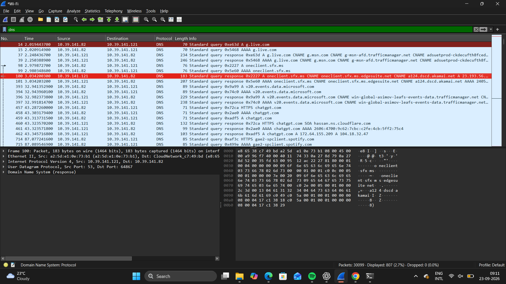
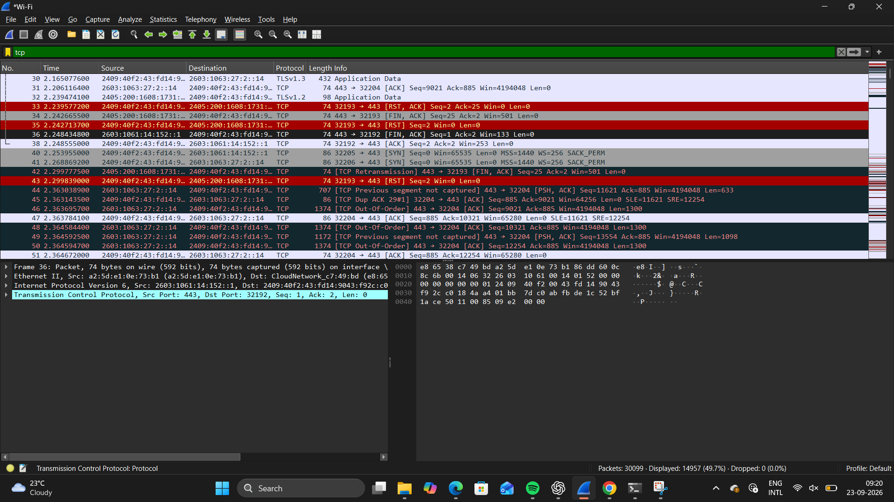
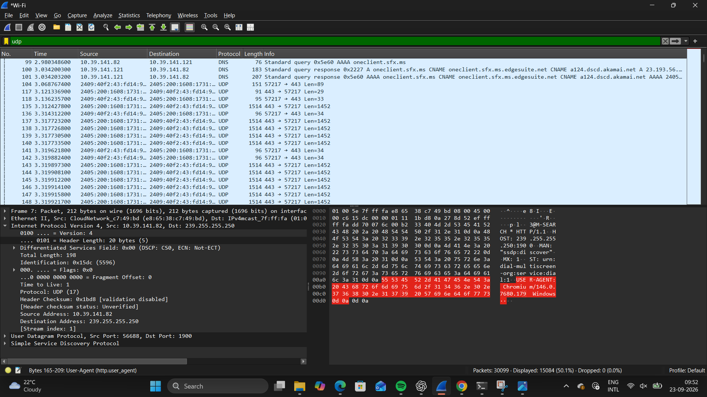
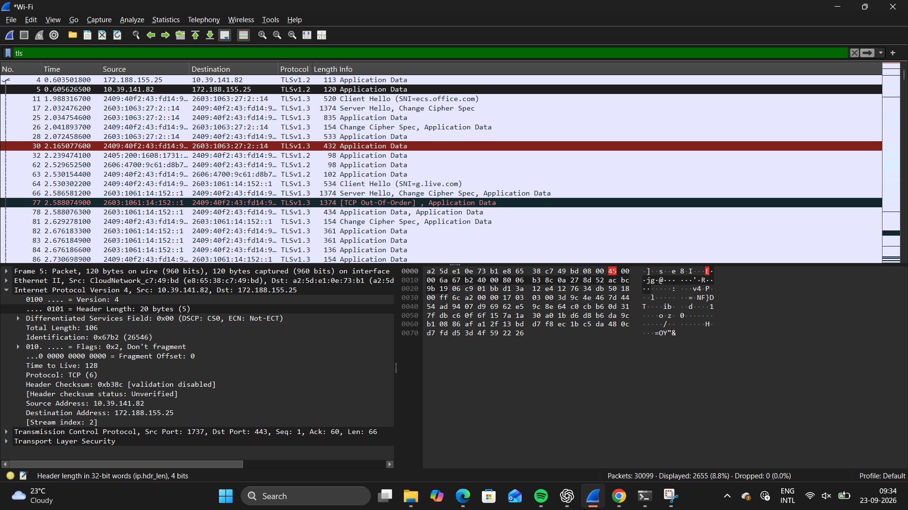

# network-traffic-analysis-wireshark
A hands-on network traffic analysis project using Wireshark.

## Project Overview

This project focuses on analyzing network traffic using Wireshark. The purpose is to understand how different network protocols communicate and to identify important packets during network activity.

## Objectives

- Capture network traffic using Wireshark
- Analyze DNS traffic
- Analyze TCP communication and the three-way handshake
- Analyze UDP traffic
- Analyze TLS/HTTPS traffic
- Understand basic network communication

## Tools Used

- Wireshark
- Windows
- Web Browser

## Protocols Analyzed

- DNS
- TCP
- UDP
- TLS/HTTPS

- ## DNS Analysis

### Observation

DNS traffic was observed during the capture. DNS queries were used to resolve domain names into IP addresses before establishing connections.

## TCP Analysis

### Observation

A TCP three-way handshake was observed:
- SYN was sent by the client.
- SYN-ACK was received from the server.
- ACK was sent by the client.
- This established the TCP connection.

## UDP Analysis

### Observation

UDP traffic was observed during the capture. The screenshot includes UDP communication using port 1900, associated with SSDP.

## TLS/HTTPS Analysis

### Observation

TLS traffic was observed during the capture. TLS is used to provide encrypted communication between the client and server, such as for HTTPS connections.

## Conclusion

This project helped me understand how DNS, TCP, UDP, and TLS protocols appear in real network traffic and how Wireshark can be used to analyze network communication.

